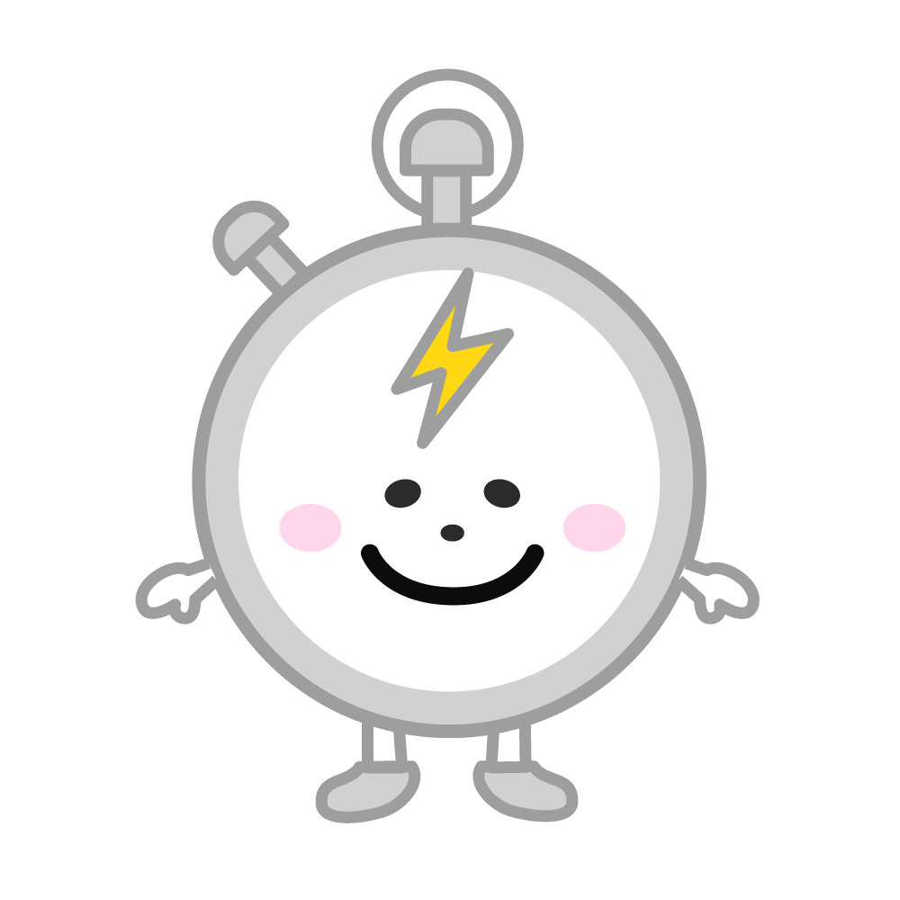

# timetable-bot

SlackBot to generate lt-timetable 🏭

using [howdyai/botkit](https://github.com/howdyai/botkit).

<p align="left">
    
</p>

<p align="left">
    <a href="./LICENSE">
        
    </a>
</p>

## Getting Started

Setting `<BOT_TOKEN>`

```sh
export BOT_TOKEN = 'XXX'
```

Use of [direnv](https://github.com/direnv/direnv) is recommended.

## Usage
Run bot process (development)

```sh
npm run start-development
```

## Command
- development: `@` mention style
- production: `/` command style

### add your talk
```
@bot lt_add_talk test 10
```

### delete my talk
```
@bot lt_delete_talk
```

### show timetable
```
@bot lt_show_timetable 15:00
```

### reschedule timetable
```
@bot lt_reschedule_timetable 15:30
```

### clear timetable
```
@bot lt_clear_timetable
```

## (Option) Pro Tips 👌

Build docker image

```sh
docker build -t timetable-bot .
```

Docker run

```sh
docker run -it --name timetable-bot timetable-bot:latest
```

## Deploy
required
```sh
export SLACK_CLIENT_ID = 'XXX'
export SLACK_CLIENT_SECRET = 'XXX'
```

option
```sh
# default 3000
export PORT = '8000'
```

[](https://heroku.com/deploy)

## Special Thanks 💚

design logo image (Created by [@mutsumi0827](https://github.com/mutsumi0827))

